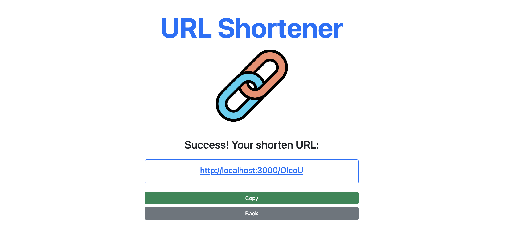

# 短網址產生器 (AC 2-3 A8)


## Screenshot - 畫面截圖



## About - 介紹
這是一個可以產生短網址的web app, 使用node.js, express, mongoDB and mongoose

## Features - 功能

1. 可以用shorten按鈕來獲得短網址
2. 在伺服器運行期間可以短網址去原本的網址
3. 可以使用copy按鈕來複製短網址

## Prerequisites - 環境建置與需求

* Node.js
* Express "^4.16.4"
* Express-handlebars "^3.1.0"

## Installation and execution - 安裝與執行步驟

1.開啟Terminal, Clone此專案至本機:
```
git clone https://github.com/klu0926/my-bitly.git
```

2.進入存放此專案的資料夾
```
cd my-bitly
```

3.安裝 npm 套件
```
npm install
```

4.安裝nodemon (如果已經有可跳過)
```
npm install -g nodemon
```

5.啟動伺服器 (這會使用 nodemon 啟動專案)
```
npm run dev 
```

6.當 terminal 出現以下字樣，表示伺服器已啟動並成功連結
```
server live on http://localhost:3000
```

7.打開瀏覽器輸入http://localhost:3000 來使用本專案